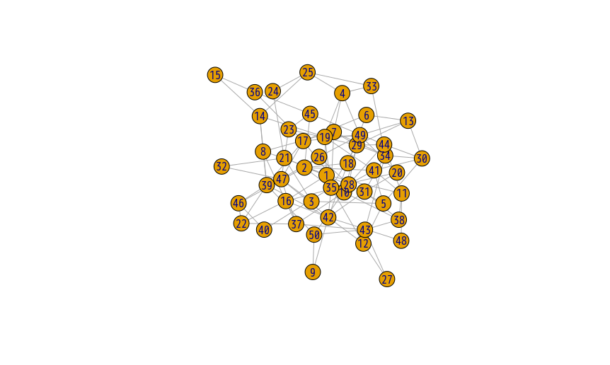

# Introduction

# Previous Studies

# Hypothesis

# Methods and Data

We applied Louvain method[@Blondel_Fast_2008]. Modularity Q is defined as follows.

$$ Q=\frac{1}{2 m}\sum_{i,j} (A_{ij} - \frac{k_i k_j}{2 m})\delta(c_i,c_j) $$

# Results

This is the observed network graph[^1].

[^1]:This is a random graph generated from Erdos-Renyi model(N = 50, p = 0.01).

# Discussion

# Future work

# Acknowledgements

# Reference